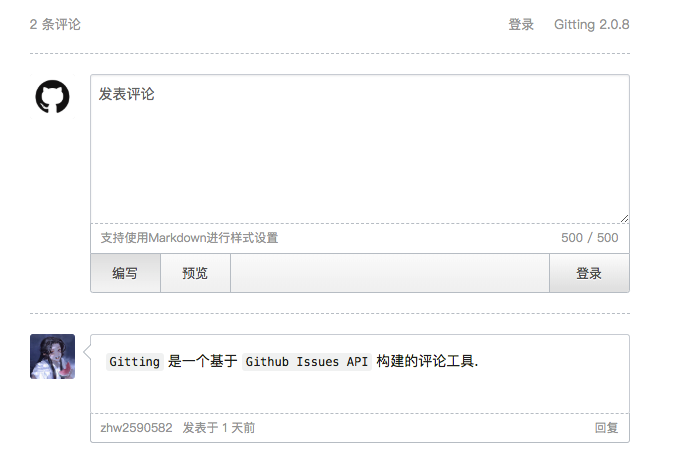

# Gitting

> Gitting is a modern comment component based on Github Issue API.

[Demo Page](https://zhw2590582.github.io/gitting/)



## Install

Install with `npm`

```
$ npm install gitting
```

Or install with `yarn`

```
$ yarn add gitting
```

```js
import Gitting from "gitting";
import "gitting/dist/gitting.css";
```

Or umd builds are also available

```html
<link href="path/to/gitting.css" rel="stylesheet">
<script src="path/to/gitting.js"></script>
```

Will expose the global variable to `window.Gitting`.

## Usage

```html
<div class="gitting-container"></div>
```

```js
import Gitting from 'gitting';

// Init
const gitting = new Gitting({
  clientID: '', // GitHub Application Client ID
  clientSecret: '', // GitHub Application Client Secret
  repo: '', // GitHub repo
  owner: '', // GitHub repo owner
  admin: [''], // GitHub repo owner and collaborators, only these guys can initialize github issues
  id: window.location.pathname, // Unique identifier as a label
  number: -1, // Issue number, Priority is greater than id
  labels: ['Gitting'], // Built-in labels, not recommended to change
  language: 'zh-cn', // 'zh-cn' and 'en'
  perPage: 10, // Number of comments per page
  maxlength: 500, // Comment on the maximum number of words
  avatar: 'https://github.githubassets.com/images/modules/logos_page/GitHub-Mark.png', // Default avatar
  proxy: 'https://cors-anywhere.herokuapp.com/https://github.com/login/oauth/access_token' // Access token proxy url
});

// Render
gitting.render('.gitting-container');

// Destroy
gitting.destroy();
```

## Related

- [gitalk](https://github.com/gitalk/gitalk) - Gitalk is a modern comment component based on Github Issue and Preact.
- [gitment](https://github.com/imsun/gitment) - A comment system based on GitHub Issues.

## License

MIT © [Harvey Zack](https://sleepy.im/)
